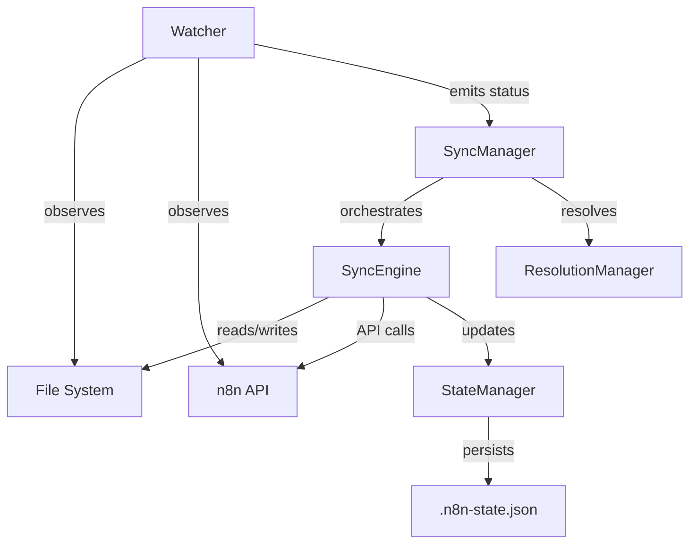
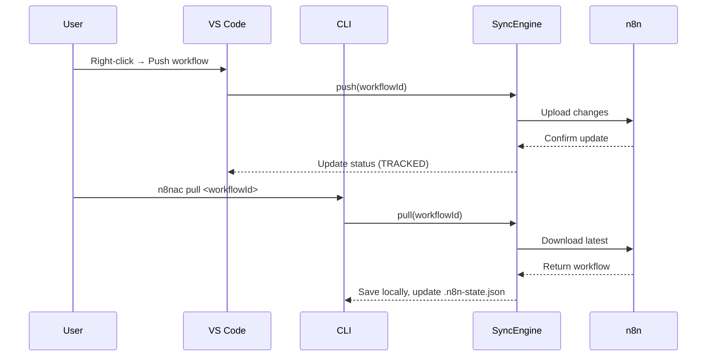

# Architecture Overview

n8n-as-code is a monorepo built with a modular architecture that separates workflow intelligence from user-facing facades.

The public brand can stay unified as `n8n-as-code` / `n8nac`, but internally there are three concerns:

1. **n8n runtime manager**: independent `n8n-manager` repo for n8n instances, auth/API keys, managed Docker runtime, tunnels, n8n projects, n8n credentials, and runtime diagnostics.
2. **n8n-as-code workspace manager**: workspace-local concerns owned by this repo: sync folder, workspace project override, AI context files, local workflow directory conventions, caches, and generated helper files.
3. **Workflow engine/commands**: workflow representation, generation, validation, schemas, templates, node knowledge, and commands that read/write workflows through a prepared n8n context.

The dependency rule is:

- `n8n-manager` must not depend on `n8n-as-code` or on workspace layout.
- Workspace management must not create, repair, or authenticate n8n instances.
- Workflow commands may compose both contexts: the effective n8n context from `n8n-manager`, and the local workspace context from `n8n-as-code`.
- User-facing and agent-facing tooling should treat `n8n-manager` and `n8nac` as two distinct CLIs, not as one meta-CLI.

In practice:

```txt
n8n-manager
  instances/auth/runtime/tunnel/projects/credentials

n8nac workspace
  workspace status, sync folder override, workspace project override, AI context

n8nac workflow commands
  list/pull/push/sync/test/workflow/execution using a prepared n8n context
```

For local end-to-end development across the separate repos, use the meta-workspace documented in [Local Dev Workspace](./local-dev-workspace.md). It preserves the published `npx --yes n8nac` default while letting dev runs override the command through one resolver.

## 🏗️ Monorepo Structure

```
n8n-as-code/
├── packages/
│   ├── cli/              # n8nac facade + current embedded sync engine
│   ├── workflow-core/    # independent workflow contracts and authoring API
│   ├── manager-adapter/  # optional facade bridge to n8n-manager
│   ├── skills/           # Workflow intelligence and AI agent context
│   ├── transformer/      # Workflow JSON <-> TypeScript conversion
│   ├── mcp/              # Agent facade
│   └── vscode-extension/ # VS Code/Cursor facade
├── plugins/
│   └── openclaw/         # OpenClaw facade
├── docs/               # Documentation (Docusaurus)
├── scripts/            # Build and utility scripts
└── plans/              # Architecture planning documents
```

Current extraction status:

```txt
packages/
  workflow-core/      # shared facade setup modes + public workflow authoring API
  manager-adapter/    # facade bridge to @n8n-as-code/n8n-manager-core and credentials-manager
  transformer/        # workflow JSON <-> TypeScript conversion
  skills/             # node knowledge, docs, validation tools
  cli/                # n8nac facade
  vscode-extension/   # VS Code/Cursor facade
  mcp/                # MCP facade

integrations/
  openclaw/
```

## 📦 Package Dependencies

```mermaid
graph TD
    A[VS Code / Cursor Facade] --> W[Workflow Engine]
    C[n8nac CLI Facade] --> W
    D[Agent Facades: MCP / Claude / OpenClaw / YAGR] --> W
    A --> M[n8n-manager]
    C --> M
    D --> M
    W -. no dependency .- M
    M --> E[n8n API]
    
    style A fill:#ff6b35
    style C fill:#ff6b35
    style D fill:#ff6b35
    style W fill:#2c3e50
    style M fill:#2c3e50
```



### Dependency Flow
1. **Workflow Engine**: Shared workflow intelligence, anchored by `@n8n-as-code/workflow-core` and still progressively extracting code from `cli/src/core`, `@n8n-as-code/skills`, `@n8n-as-code/transformer`, schemas, and generated indexes.
2. **Runtime Engine**: `n8n-manager`, external repo, owns setup, credentials, diagnostics, deployment, execution, and inspection.
3. **Facades**: `n8nac`, VS Code/Cursor extension, MCP, Claude Code, OpenClaw, YAGR integration. These provide UX and may orchestrate both engines through `@n8n-as-code/manager-adapter`.

Facade setup UX should converge on:

```txt
How do you want to use n8n?

[Recommended] Create and manage a local n8n automatically
[Connect an existing n8n]
[Use generation-only mode]
```

## 🧩 Sync Engine Architecture (inside `cli`)

### 3-Way Merge Architecture

The sync library implements a **3-way merge architecture** that cleanly separates state observation from state mutation:



### Key Principles

1. **Separation of Concerns**: Watcher observes, SyncEngine mutates
2. **3-Way Comparison**: Uses base-local-remote to detect conflicts
3. **Deterministic Detection**: Only flags conflicts when both sides changed
4. **State Persistence**: `.n8n-state.json` tracks last synced state (base)

### Service Layer

```typescript
// Sync services architecture
classDiagram
    class Watcher {
        +start()
        +stop()
        +scanLocalFiles()
        +refreshRemoteState()
        -calculateStatus()
    }
    
    class SyncEngine {
        +push(workflow)
        +pull(workflow)
        +delete(workflow)
        +finalizeSync(workflow)
    }
    
    class ResolutionManager {
        +promptForConflict()
        +promptForDeletion()
        +resolveConflict()
    }
    
    class SyncManager {
        +listWorkflows()
        +fetch(workflowId)
        +pull(workflowId)
        +push(workflowId)
        +resolveConflict()
        +refreshLocalState()
        +refreshRemoteState()
    }
    
    class StateManager {
        +loadState()
        +saveState()
        +updateWorkflowState()
    }
    
    class N8nApiClient {
        +getWorkflows()
        +getWorkflow()
        +updateWorkflow()
        +createWorkflow()
    }
    
    class WorkflowSanitizer {
        +sanitize()
        +validate()
        +sortNodes()
    }
    
    SyncManager --> Watcher
    SyncManager --> SyncEngine
    SyncManager --> ResolutionManager
    SyncEngine --> StateManager
    SyncEngine --> N8nApiClient
    SyncEngine --> WorkflowSanitizer
    Watcher --> StateManager
```

### Key Components

#### 1. **Watcher** (State Observation)
- **Passive observer** that never performs sync operations
- Watches file system for local changes (with 500ms debouncing)
- Polls n8n API for remote changes
- Calculates workflow status using 3-way comparison:
  - `localHash` - SHA-256 hash of current file content
  - `remoteHash` - SHA-256 hash of current n8n workflow
  - `lastSyncedHash` - SHA-256 hash from `.n8n-state.json` (base)
- Emits status events: `status-changed`, `conflict`, `deletion`

#### 2. **SyncEngine** (State Mutation)
- **Stateless I/O executor** that performs actual sync operations
- `push()` - Uploads local workflow to n8n
- `pull()` - Downloads remote workflow to local file
- `delete()` - Deletes workflow from n8n or local
- `finalizeSync()` - Updates `.n8n-state.json` after successful operations
- Creates backups before destructive operations
- Uses WorkflowSanitizer to clean workflows before saving

#### 3. **ResolutionManager**
- Dedicated service for interactive conflict and deletion resolution
- Provides CLI prompts for user decisions
- Handles "show diff" functionality
- Maintains separation between automated and user-driven actions

#### 4. **SyncManager** (Orchestration)
- High-level orchestrator that coordinates components
- `listWorkflows()` - Lists all workflows with current sync status
- `fetch(workflowId)` - Updates remote state cache for a specific workflow
- `pull(workflowId)` - Downloads remote workflow to local file
- `push(workflowId)` - Uploads local workflow to n8n
- `resolveConflict()` - Force-resolves conflicts keeping local or remote
- Emits events: `log`, `conflict`, `change`, `error`, `connection-lost`

#### 5. **StateManager**
- Manages `.n8n-state.json` file (the "base" in 3-way merge)
- Tracks `lastSyncedHash` and `lastSyncedAt` for each workflow
- Provides atomic read/write operations
- Enables 3-way merge conflict detection

#### 6. **N8n API Client**
- Communicates with n8n REST API
- Handles authentication and rate limiting
- Provides typed API responses

#### 7. **Workflow Sanitizer**
- Validates workflow JSON structure
- Removes sensitive data (credentials)
- Sorts nodes and connections canonically for consistent hashing
- Ensures compatibility with n8n

### 5 Workflow States

Based on 3-way comparison (base vs local vs remote):

| Status | Icon | Description |
|--------|------|--------------|
| `TRACKED` | 📄 plain file | Both local and remote exist; either side may have changed — user syncs explicitly |
| `CONFLICT` | 🔴 red alert | Both local and remote changed since last sync |
| `EXIST_ONLY_LOCALLY` | 📄+ orange file-add | New workflow created locally, not yet pushed |
| `EXIST_ONLY_REMOTELY` | ☁️ blue cloud | Workflow exists remotely, not yet pulled locally |

## 🔌 VS Code Extension Architecture

### Extension Components
```typescript
// VS Code extension architecture
classDiagram
    class Extension {
        +activate()
        +deactivate()
    }
    
    class WorkflowTreeProvider {
        +getTreeItem()
        +getChildren()
        +refresh()
    }
    
    class WorkflowWebview {
        +render()
        +update()
        +handleMessage()
    }
    
    class ProxyService {
        +forwardRequest()
        +handleResponse()
    }
    
    Extension --> WorkflowTreeProvider
    Extension --> WorkflowWebview
    Extension --> ProxyService
    WorkflowWebview --> ProxyService
```

### Communication Flow
1. **Tree View**: Displays workflows organized by instance
2. **Webview**: Renders n8n canvas for visual editing
3. **Proxy Service**: Bridges VS Code and n8n API
4. **Sync Integration**: Uses Sync library for synchronization

## 🖥️ CLI Architecture

### Command Structure
```typescript
// CLI command architecture
classDiagram
    class CLI {
        +parseArgs()
        +executeCommand()
    }
    
    class BaseCommand {
        +run()
        +validate()
        +execute()
    }
    
    class InitCommand {
        +initializeProject()
        +createConfig()
    }
    
    class SyncCommand {
        +syncWorkflows()
        +handleConflicts()
    }
    
    class ListCommand {
        +listWorkflows()
        +filterByStatus()
    }
    
    CLI --> BaseCommand
    BaseCommand <|-- InitCommand
    BaseCommand <|-- SyncCommand
    BaseCommand <|-- ListCommand
```

### Command Processing
1. **Argument Parsing**: Commander.js for CLI parsing
2. **Command Execution**: Each command extends BaseCommand
3. **Configuration**: Loads from file, env vars, or args
4. **Error Handling**: Consistent error reporting

## 🤖 Skills Library Architecture (`n8nac skills`)

### AI Integration
The `@n8n-as-code/skills` package is an internal library exposed publicly via the `n8nac skills` subcommand group. It powers AI context generation for Cursor, Cline, Copilot, and other AI tools.

```typescript
// Skills Library architecture
classDiagram
    class AgentCLI {
        +generateContext()
        +processRequest()
    }
    
    class AIContextGenerator {
        +generateAgentsMD()
        +generateSchema()
        +generateSnippets()
    }
    
    class NodeSchemaProvider {
        +getNodeSchemas()
        +validateNode()
    }
    
    class SnippetGenerator {
        +generateSnippets()
        +formatSnippet()
    }
    
    AgentCLI --> AIContextGenerator
    AgentCLI --> NodeSchemaProvider
    AgentCLI --> SnippetGenerator
```

### Context Generation
1. **AGENTS.md**: Instructions for AI assistants
2. **n8n-schema.json**: Validation schema
3. **Code Snippets**: VS Code snippets for common patterns

## 🔄 Data Flow

### Synchronization Flow


### Conflict Resolution
1. **Detection**: State Manager detects conflicting changes
2. **Notification**: User is notified of conflict
3. **Resolution**: Options: keep local, keep remote, or merge
4. **Sync**: Resolved workflow is synchronized

## 🏭 Build System

### TypeScript Configuration
- **Base Config**: Shared TypeScript configuration
- **Package Configs**: Individual package configurations
- **Build Scripts**: Unified build process

### Testing Strategy
- **Unit Tests**: Jest for individual components
- **Integration Tests**: End-to-end workflow tests
- **Mocking**: Nock for HTTP requests, in-memory file system

### CI/CD Pipeline
1. **Linting**: ESLint with TypeScript support
2. **Testing**: Jest with coverage reporting
3. **Building**: TypeScript compilation
4. **Publishing**: Custom commit-driven release automation

## 🔐 Security Architecture

### Credential Management
- **Never Stored**: Credentials never committed to Git
- **Environment Variables**: API keys via env vars
- **Configuration Files**: Local config with gitignore

### Data Sanitization
- **Workflow Sanitization**: Removes credentials before storage
- **Validation**: Schema validation for all inputs
- **Error Handling**: Secure error messages without sensitive data

## 📈 Scalability Considerations

### Performance Optimizations
- **Batch Operations**: Bulk sync operations
- **Caching**: Local state caching
- **Incremental Sync**: Only sync changed workflows

### Memory Management
- **Stream Processing**: Large workflow processing
- **Cleanup**: Proper resource disposal
- **Monitoring**: Memory usage tracking

## 🛠️ Development Workflow

### Local Development
```bash
# Install dependencies
npm install

# Build all packages
npm run build

# Run tests
npm test

# Start documentation
npm run docs
```

### Package Management
- **Workspaces**: npm workspaces for monorepo
- **Dependencies**: Shared and package-specific deps
- **Versioning**: Independent versioning with commit-driven release automation


## 📚 Related Documentation

- [Sync Engine](/docs/contribution/sync): Sync engine internals (embedded in CLI)
- [Skills Library](/docs/contribution/skills): AI integration details
- [Contribution Guide](/docs/contribution): How to contribute

---

*This architecture enables n8n-as-code to provide a seamless experience across different interfaces while maintaining a single source of truth for workflow management.*
